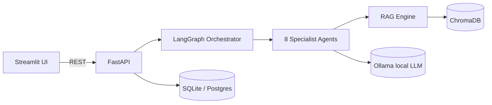
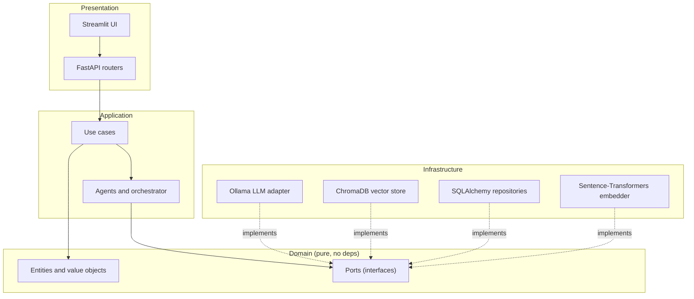

<div align="center">

# 🧠 AI Data Engineering Copilot

**An AI teammate that automates the everyday work of a data engineer** — generating and optimizing SQL & PySpark, scaffolding ETL / Medallion pipelines, dbt models, Airflow DAGs, and data-quality suites, writing documentation, and answering questions grounded in **your own documents** via Retrieval-Augmented Generation.

*Runs 100% locally and free — Ollama + ChromaDB, no paid APIs. One command: `docker compose up`.*

[](https://github.com/Indir07/AI-Data-Engineering-Copilot/actions/workflows/ci.yml)
[](https://www.python.org/)
[](https://fastapi.tiangolo.com/)
[](https://langchain-ai.github.io/langgraph/)
[-black)](https://ollama.com/)
[](https://github.com/psf/black)
[](https://github.com/astral-sh/ruff)
[](LICENSE)

[Quickstart](#-quickstart) · [Architecture](#️-architecture) · [Usage](#-usage) · [Configuration](#️-configuration) · [Testing](#-testing) · [Docs](#-documentation)

</div>

---

## 📖 Overview

Data engineers spend hours on repetitive, pattern-heavy work: writing boilerplate SQL, translating between dialects, tuning Spark jobs, wiring Bronze → Silver → Gold layers, authoring dbt models and Airflow DAGs, and documenting all of it. **AI Data Engineering Copilot** turns those chores into *task-shaped* requests answered by a team of specialist agents — not a generic chatbot, but a colleague that speaks data engineering.

Just as importantly, it is **deliberately engineered like production software** — Clean/Hexagonal architecture, ports & adapters, a full test pyramid, CI/CD, and containerization — so it doubles as a **portfolio-grade demonstration** of modern Data + AI Engineering.

> **Project status:** ✅ All 12 build phases complete · CI green (lint · type-check · tests) · fully local & free to run.

### Why this project stands out

- **Clean Architecture, enforced.** The domain is pure Python with zero framework imports; every external capability (LLM, vector store, database) sits behind a `Protocol` port with swappable adapters. A CI rule verifies the dependency direction never inverts.
- **A real multi-agent system.** Eight specialists coordinated by a **LangGraph** state graph, each a single-responsibility unit built on a shared template.
- **Grounded answers (RAG).** Upload PDFs / Markdown / CSV / TXT; the copilot embeds, indexes, retrieves, and **cites** them.
- **100% free & reproducible.** Local inference (Ollama), local embeddings (Sentence-Transformers), embedded vector store (ChromaDB). No API keys, ever.
- **Ships like a product.** `docker compose up`, GitHub Actions CI, Alembic migrations, and cloud-ready Kubernetes/Terraform manifests.

---

## ✨ Features

| Domain | What the Copilot does |
|--------|-----------------------|
| **SQL** | generate · explain · debug · optimize · convert between dialects (Postgres, Snowflake, BigQuery, Databricks, DuckDB, Spark…) |
| **PySpark** | generate transformations · optimize jobs · explain Spark errors |
| **ETL** | Bronze / Silver / Gold · incremental loads · CDC · Slowly Changing Dimensions |
| **Data Quality** | Great Expectations & Soda suites · profiling · anomaly hints |
| **Airflow** | DAGs · scheduling · retries · task groups · sensors |
| **dbt** | models · tests · sources · snapshots · macros |
| **Documentation** | README · architecture · API · pipeline & data-flow docs |
| **RAG** | index & semantically search your PDFs / Markdown / CSV / TXT and ground every answer with citations |

---

## 🏗️ Architecture

The copilot uses **Clean / Hexagonal Architecture**: dependencies point *inward only* (`presentation → application → domain`, `infrastructure → domain`). The domain defines interfaces (ports); infrastructure supplies interchangeable implementations (adapters).



### Layers



Full C4 diagrams, sequence diagrams, and the reasoning behind every choice live in **[docs/ARCHITECTURE.md](docs/ARCHITECTURE.md)**, with each significant decision captured as an **[ADR](docs/adr/)**.

---

## 🧰 Tech Stack

| Area | Technologies |
|------|--------------|
| **Core** | Python 3.11 · FastAPI · Streamlit · Pydantic v2 · pydantic-settings |
| **AI / Agents** | LangGraph · Ollama · Qwen2.5-Coder / Llama 3.1 · Sentence-Transformers · ChromaDB |
| **Data** | PySpark · DuckDB · Polars · Pandas · SQLAlchemy 2.0 · SQLite / PostgreSQL |
| **DE tooling (targets)** | Apache Airflow · dbt · Great Expectations · Soda |
| **Platform** | Docker · Docker Compose · Alembic · GitHub Actions · Kubernetes / Terraform (stubs) |
| **Quality** | pytest · black · ruff · mypy · pre-commit |

> **Free by design.** Inference (Ollama), embeddings (Sentence-Transformers), and the vector store (ChromaDB) all run locally — see [ADR-0002](docs/adr/0002-local-llm-runtime.md) and [ADR-0005](docs/adr/0005-model-agnostic-llm-provider.md). The LLM sits behind a model-agnostic provider, so swapping models (or a hosted OpenAI-compatible endpoint) is a config change, not a code change.

---

## 📁 Project Structure

```
ai-data-engineering-copilot/
├── src/copilot/
│   ├── domain/          # Entities, value objects, ports (pure — no frameworks)
│   ├── application/     # Use cases, DTOs, services (business orchestration)
│   ├── agents/          # 8 specialist agents + LangGraph orchestrator
│   ├── rag/             # Ingestion · chunking · embeddings · retrieval
│   ├── infrastructure/  # Adapters: Ollama, ChromaDB, SQLAlchemy, embeddings
│   ├── presentation/    # FastAPI (api/) + Streamlit (ui/)
│   └── config/          # Settings, logging, DI composition root
├── tests/               # unit · integration · e2e (fakes for all external deps)
├── migrations/          # Alembic schema migrations
├── deploy/              # docker/ · k8s/ · terraform/ (cloud-ready)
├── docs/                # ARCHITECTURE · ADRs · API · DATA_FLOW · diagrams
├── docker-compose.yml   # Full stack: ui + api + ollama + postgres
├── Dockerfile           # Single image for api & ui
└── pyproject.toml       # Package + black/ruff/mypy/pytest config
```

---

## 🚀 Quickstart

### Option A — Docker Compose (recommended)

**Prerequisites:** Docker + Docker Compose, and ~8 GB RAM free for a 7B model.

```bash
git clone https://github.com/Indir07/AI-Data-Engineering-Copilot.git
cd AI-Data-Engineering-Copilot
cp .env.example .env

docker compose up --build          # starts ui, api, ollama, postgres

# One-time: pull the local models into Ollama
docker compose exec ollama ollama pull qwen2.5-coder:7b-instruct
docker compose exec ollama ollama pull llama3.1:8b-instruct   # optional alternate
```

| Service | URL |
|---------|-----|
| 🖥️ Streamlit UI | http://localhost:8501 |
| ⚡ API + Swagger | http://localhost:8000/docs |
| 🤖 Ollama | http://localhost:11434 |

### Option B — Local development (without Docker)

**Prerequisites:** Python 3.11+, and [Ollama](https://ollama.com/) running locally.

```bash
git clone https://github.com/Indir07/AI-Data-Engineering-Copilot.git
cd AI-Data-Engineering-Copilot

python -m venv .venv
source .venv/bin/activate            # Windows: .venv\Scripts\activate

pip install -e ".[dev]"              # or: pip install -r requirements/dev.txt
pre-commit install
cp .env.example .env                 # defaults to SQLite + local Ollama

# Terminal 1 — API
uvicorn copilot.presentation.api.main:app --reload      # http://localhost:8000/docs
# Terminal 2 — UI
streamlit run src/copilot/presentation/ui/app.py        # http://localhost:8501
```

Confirm the backend is alive:

```bash
curl http://localhost:8000/health
# {"status":"ok","version":"0.1.0","app_env":"local","llm_model":"qwen2.5-coder:7b-instruct"}
```

> Handy `make` targets: `make run-api`, `make run-ui`, `make test`, `make lint`, `make format`, `make up`, `make down`. Run `make help` for the full list.

---

## 💻 Usage

### Streamlit dashboard

Pick a specialist in the sidebar, choose a SQL dialect (for the SQL agent), tweak model/temperature, optionally upload documents for RAG grounding, and chat. Generated code is rendered with syntax highlighting, answers show their **citations**, and every response has a **download** button.

### API (examples)

```bash
# Run the SQL agent
curl -s localhost:8000/agents/sql -H 'content-type: application/json' -d '{
  "prompt": "top 10 customers by revenue in the last 90 days",
  "dialect": "postgres"
}'

# Persistent, multi-turn conversation
curl -s localhost:8000/conversations -H 'content-type: application/json' -d '{
  "prompt": "Explain the medallion architecture"
}'

# Index a document, then search it (RAG)
curl -s -F 'file=@medallion.md' localhost:8000/upload
curl -s localhost:8000/rag/search -H 'content-type: application/json' -d '{
  "query": "how is the silver layer defined?", "top_k": 5
}'
```

Every endpoint is documented (with schemas and curl snippets) in **[docs/API.md](docs/API.md)** and interactively at `/docs`.

---

## ⚙️ Configuration

All configuration is environment-driven (12-factor) via `.env` — see `.env.example`. Highlights:

| Variable | Default | Purpose |
|----------|---------|---------|
| `LLM_PROVIDER` | `ollama` | LLM backend (model-agnostic) |
| `LLM_MODEL` | `qwen2.5-coder:7b-instruct` | Default model; swap freely |
| `OLLAMA_BASE_URL` | `http://ollama:11434` | Ollama endpoint |
| `EMBEDDING_MODEL` | `BAAI/bge-small-en-v1.5` | Sentence-Transformers model |
| `VECTOR_STORE` / `CHROMA_PERSIST_DIR` | `chroma` / `./data/chroma` | Vector index |
| `DATABASE_URL` | `sqlite:///./data/copilot.db` | SQLite locally, Postgres in compose |
| `RAG_TOP_K` / `RAG_CHUNK_SIZE` / `RAG_CHUNK_OVERLAP` | `5` / `800` / `120` | Retrieval + chunking |

---

## 🧪 Testing

A full test pyramid, made cheap by ports & adapters — nearly everything runs with fast fakes, no external services.

```bash
pytest                      # everything
pytest -m unit              # fast inner loop (all I/O mocked)
pytest -m "not integration" # skip infra-touching tests
pytest --cov=copilot --cov-report=html
```

| Layer | Scope | External deps |
|-------|-------|---------------|
| `unit` | one unit in isolation | none (fakes) |
| `integration` | real adapter (SQLite, LangGraph) | local only |
| `e2e` | full journey through the API | none (adapters faked) |

Details in **[docs/TESTING.md](docs/TESTING.md)**.

---

## 🔄 CI/CD

Every push and PR to `main` runs **[GitHub Actions](.github/workflows/ci.yml)**:

- **Lint** — `ruff` + `black --check`
- **Type check** — `mypy` (advisory)
- **Tests + coverage** — `pytest`

A separate **[image-publish workflow](.github/workflows/docker-publish.yml)** builds and pushes the container image to GHCR on version tags.

---

## ☁️ Deployment

`docker compose up` is the supported local path. The **same image** targets a cluster: `deploy/k8s/` holds reviewable Kubernetes manifests (Deployments, Services, HPA, Ingress, `kustomization`) and `deploy/terraform/` sketches the cloud resources. Because the app is 12-factor and every dependency sits behind a port, the cloud path is short and credible — see **[docs/DEPLOYMENT.md](docs/DEPLOYMENT.md)** and [ADR-0006](docs/adr/0006-deployment-compose-cloud-ready.md).

---

## 📚 Documentation

- **[Architecture](docs/ARCHITECTURE.md)** — C4 diagrams, layers, and rationale
- **[Architecture Decision Records](docs/adr/)** — the *why* behind each choice
- **[API Reference](docs/API.md)** — every endpoint with curl examples
- **[Data Flow](docs/DATA_FLOW.md)** — request, ingestion, and persistence journeys
- **[Developer Guide](docs/DEVELOPER_GUIDE.md)** · **[Testing](docs/TESTING.md)** · **[Deployment](docs/DEPLOYMENT.md)** · **[Contributing](CONTRIBUTING.md)**
- **[Changelog](CHANGELOG.md)**

---

## 🗺️ Roadmap

- [x] **Phase 1** — Architecture, folder structure, technology decisions
- [x] **Phase 2** — Repository initialization & tooling
- [x] **Phase 3** — Backend (FastAPI, config, DI, ports)
- [x] **Phase 4** — Database & persistence (SQLAlchemy + Alembic)
- [x] **Phase 5** — RAG engine (embeddings, ChromaDB, retrieval)
- [x] **Phase 6** — Multi-agent system + LangGraph orchestrator
- [x] **Phase 7** — Streamlit dashboard
- [x] **Phase 8** — Docker & Compose
- [x] **Phase 9** — Testing (unit · integration · e2e)
- [x] **Phase 10** — Deployment (cloud-ready manifests)
- [x] **Phase 11** — CI/CD (GitHub Actions)
- [x] **Phase 12** — Documentation

Future ideas: streaming responses, an auto-router node (classify prompt → pick agent), semantic chunking, a model-evaluation harness, and pgvector as a managed vector store.

---

## 🤝 Contributing

Contributions are welcome! Please read **[CONTRIBUTING.md](CONTRIBUTING.md)** — it covers the dev loop (`make format lint typecheck test`), the architecture rules (respect the dependency direction; new external capability → new port + adapter), and the ADR process.

---

## 📄 License

Released under the [MIT License](LICENSE).

---

<div align="center">

*Built as a production-quality portfolio project demonstrating modern Data & AI Engineering.*

</div>
