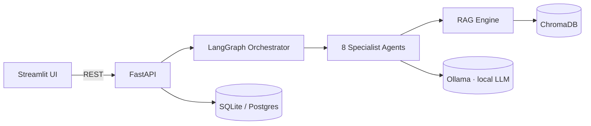

<div align="center">

# 🧠 AI Data Engineering Copilot

**An AI teammate that automates the everyday work of a data engineer — generating and optimizing SQL & PySpark, scaffolding ETL / Medallion pipelines, dbt models, Airflow DAGs, data-quality suites, and documentation — grounded in your own docs via RAG.**

*Runs 100% locally and free (Ollama + ChromaDB). One command: `docker compose up`.*

[](https://www.python.org/)
[](https://fastapi.tiangolo.com/)
[](https://langchain-ai.github.io/langgraph/)
[-black)](https://ollama.com/)
[](LICENSE)
[](https://github.com/psf/black)

</div>

---

> **Project status: Phases 1–8 done (RAG engine, Phase 5, is next).**
> Backend, persistence, the 8-agent system, the Streamlit dashboard, and the
> `docker compose` stack are in place. See the [Roadmap](#-roadmap).

## Why this project exists

Data engineers spend hours on repetitive, pattern-heavy work: writing boilerplate
SQL, translating between dialects, tuning Spark jobs, wiring Bronze→Silver→Gold
layers, authoring dbt models and Airflow DAGs, and documenting all of it. The
Copilot turns those into **task-shaped requests** answered by specialist agents —
not a generic chatbot, but a teammate that speaks data engineering.

It is deliberately built like production software (Clean Architecture, ports &
adapters, full test pyramid, CI, containerized) so it doubles as a **portfolio
piece** demonstrating modern Data + AI engineering.

## ✨ Capabilities

| Domain | What the Copilot does |
|--------|-----------------------|
| **SQL** | generate · explain · debug · optimize · convert dialects |
| **PySpark** | generate transformations · optimize jobs · explain Spark errors |
| **ETL** | Bronze/Silver/Gold · incremental loads · CDC · Slowly Changing Dimensions |
| **Data Quality** | Great Expectations & Soda suites · profiling · anomaly hints |
| **Airflow** | DAGs · scheduling · retries · task groups · sensors |
| **dbt** | models · tests · sources · snapshots · macros |
| **Documentation** | README · architecture · API · pipeline & data-flow docs |
| **RAG** | index & semantically search your PDFs / Markdown / CSV / TXT and ground every answer with citations |

## 🏗️ Architecture at a glance



Clean/Hexagonal layering keeps business logic free of frameworks: the **domain**
defines ports (`LLMPort`, `VectorStorePort`, repositories…) and **infrastructure**
provides swappable adapters. Full rationale and C4 diagrams live in
[`docs/ARCHITECTURE.md`](docs/ARCHITECTURE.md); every major choice has an
[ADR](docs/adr/).

## 🧰 Tech stack

**Core:** Python 3.11 · FastAPI · Streamlit · Pydantic
**AI:** LangGraph · Ollama · Qwen2.5-Coder / Llama 3.1 · Sentence-Transformers · ChromaDB
**Data:** PySpark · DuckDB · Polars · Pandas · SQLAlchemy · SQLite / PostgreSQL
**DE tooling targets:** Apache Airflow · dbt · Great Expectations · Soda
**Platform:** Docker · Docker Compose · GitHub Actions
**Quality:** pytest · black · ruff · mypy · pre-commit

> **Free by design:** no paid APIs. Inference (Ollama), embeddings
> (Sentence-Transformers), and the vector store (ChromaDB) all run locally. See
> [ADR-0002](docs/adr/0002-local-llm-runtime.md) and
> [ADR-0005](docs/adr/0005-model-agnostic-llm-provider.md).

## 📁 Repository layout

```
src/copilot/
├── domain/          # entities, value objects, ports (pure, no frameworks)
├── application/     # use cases, DTOs, services
├── agents/          # 8 specialist agents + LangGraph orchestrator
├── rag/             # ingestion · chunking · embeddings · retrieval
├── infrastructure/  # adapters: Ollama, Chroma, SQLAlchemy, file storage
├── presentation/    # FastAPI (api/) + Streamlit (ui/)
└── config/          # settings, logging, DI composition root
tests/               # unit · integration · e2e
docs/                # ARCHITECTURE.md · adr/ · diagrams/
deploy/              # docker/ · k8s/ · terraform/ (cloud-ready stubs)
```

## 🚀 Quickstart

```bash
git clone https://github.com/Indir07/AI-Data-Engineering-Copilot.git
cd AI-Data-Engineering-Copilot
cp .env.example .env
docker compose up --build      # starts ui, api, ollama, postgres
make pull-models               # pull Qwen2.5-Coder + Llama 3.1 into Ollama
# UI  → http://localhost:8501
# API → http://localhost:8000/docs
```

## 🗺️ Roadmap

- [x] **Phase 1** — Architecture, folder structure, technology decisions
- [x] **Phase 2** — Repository initialization & tooling
- [x] **Phase 3** — Backend (FastAPI, config, DI, ports)
- [x] **Phase 4** — Database & persistence
- [ ] **Phase 5** — RAG engine
- [x] **Phase 6** — Agents + orchestrator
- [x] **Phase 7** — Streamlit UI
- [x] **Phase 8** — Docker & Compose
- [ ] **Phase 9** — Testing
- [ ] **Phase 10** — Deployment (cloud-ready)
- [ ] **Phase 11** — CI/CD (GitHub Actions)
- [ ] **Phase 12** — Documentation polish

## 📄 License

MIT — see [LICENSE](LICENSE).
