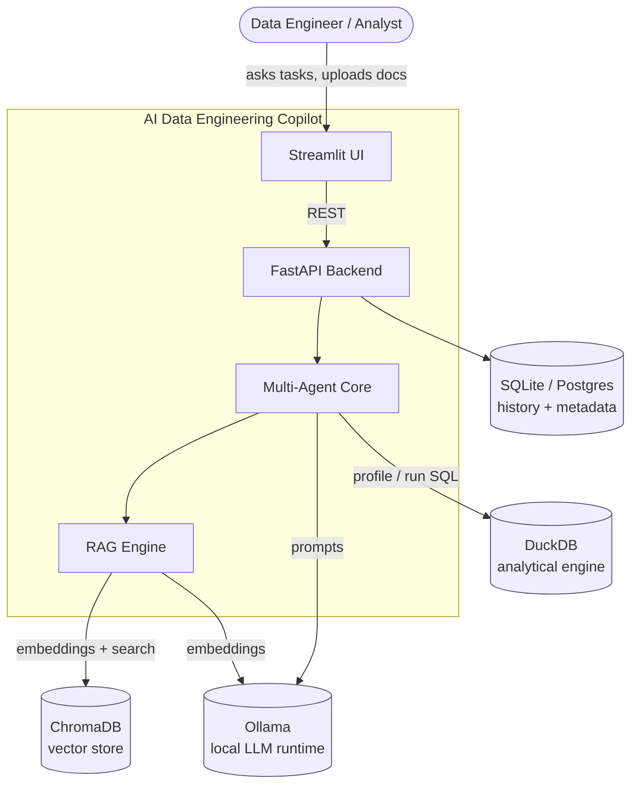
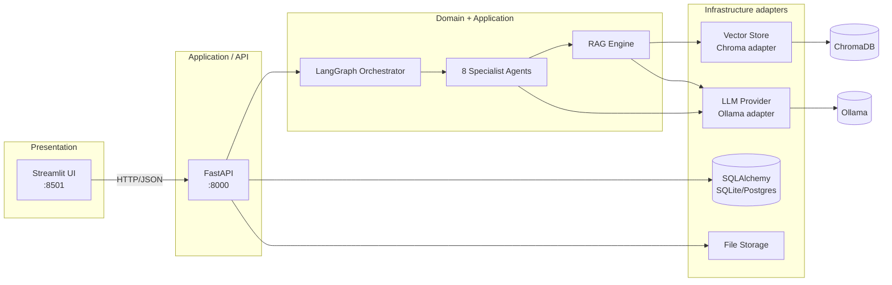
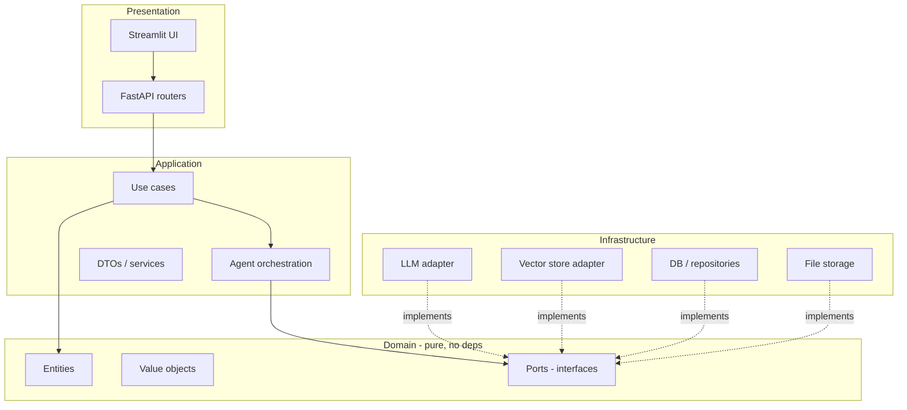
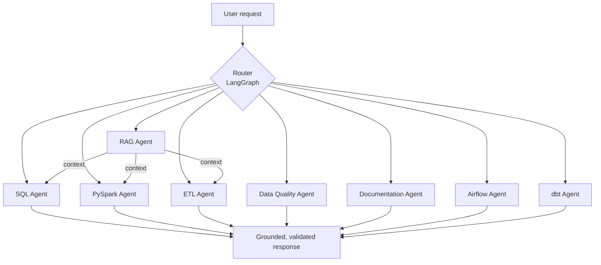
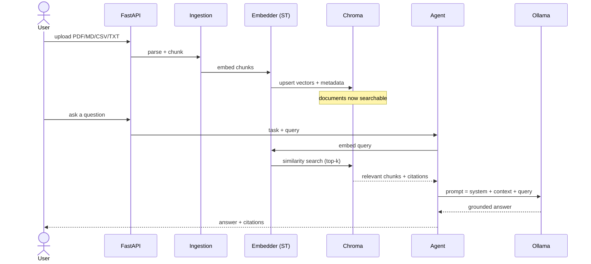
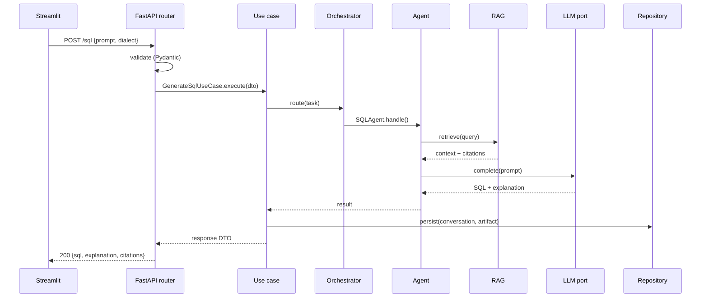
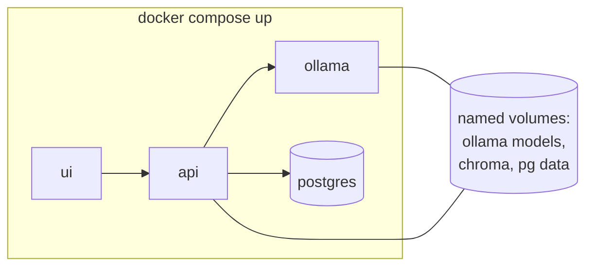

# Architecture — AI Data Engineering Copilot

> **Status:** Phase 1 (design). This document is the single source of truth for
> the system's structure and the *reasoning* behind each decision. Every later
> phase must conform to what is described here or amend it via an ADR
> (`docs/adr/`).

---

## 1. What we are building and why the design matters

The Copilot is an **AI teammate for data engineers**. Instead of a generic chat
box, it exposes *task-shaped* capabilities — generate/optimize/explain/debug
SQL, generate & tune PySpark, scaffold ETL and Medallion pipelines, produce
Airflow DAGs and dbt models, run data-quality analysis, write documentation, and
answer questions grounded in the user's own docs via RAG.

Two forces shape the architecture:

1. **It must be believable as production software**, not a notebook. That means
   clear boundaries, dependency inversion, testability, and the ability to swap
   infrastructure (LLM, vector store, database) without touching business logic.
2. **It must be free to run.** No paid APIs. Inference is local (Ollama), the
   vector store is embedded (ChromaDB), embeddings are local
   (Sentence-Transformers), and everything starts with `docker compose up`.

The design that satisfies both is **Clean/Hexagonal Architecture with a
multi-agent application layer**.

---

## 2. C4 Level 1 — System context



**Why local, embedded dependencies?** Each external box is replaceable through a
port (see §5). For the portfolio we run the free/local implementation; the same
interfaces would accept a managed cloud service (e.g. pgvector, a hosted LLM) in
an enterprise deployment. This is the single most important "senior" signal:
*infrastructure is a detail, not the center of the system.*

---

## 3. C4 Level 2 — Containers



Containers and their single responsibility:

| Container | Responsibility | Tech |
|-----------|----------------|------|
| Streamlit UI | Human interface: agent picker, chat, code view, uploads, downloads | Streamlit |
| FastAPI | HTTP boundary, validation, auth hook, request→use-case wiring | FastAPI + Pydantic |
| Orchestrator | Route a request to the right agent(s), manage state, tool calls | LangGraph |
| Agents | Task-specific reasoning + prompt strategies | Python + LLM port |
| RAG Engine | Ingest, chunk, embed, retrieve, ground answers | Sentence-Transformers + Chroma |
| Infrastructure | Concrete adapters implementing domain ports | Ollama, Chroma, SQLAlchemy |

The UI and API are **separate containers on purpose**: the API is the real
product surface (also consumable by CI, scripts, or another frontend), and the
UI is one client of many. This mirrors how real data platforms are built.

---

## 4. Clean Architecture layers

The dependency rule points **inward only**: `presentation → application →
domain`, and `infrastructure → domain`. The domain knows nothing about FastAPI,
Ollama, or Chroma.



**Directory ↔ layer mapping** (`src/copilot/`):

```
domain/          # Enterprise rules. Pure Python. No framework imports.
  entities/         e.g. Conversation, AgentTask, Document, DataQualityReport
  value_objects/    e.g. SqlDialect, ModelName, Chunk, Citation
  ports/            Protocols: LLMPort, VectorStorePort, EmbedderPort,
                    DocumentRepository, ConversationRepository
application/      # Use cases orchestrating domain + ports.
  use_cases/        GenerateSqlUseCase, ChatUseCase, IngestDocumentUseCase, ...
  services/         cross-cutting app services (prompt assembly, routing)
  dto/              request/response data-transfer objects
agents/          # The 8 specialists + LangGraph orchestrator (application-level).
infrastructure/  # Concrete adapters that implement domain ports.
  llm/              OllamaProvider, provider factory, retry/timeout
  vectorstore/      ChromaVectorStore
  persistence/      SQLAlchemy models + repositories
  prompts/          versioned prompt templates
presentation/    # Delivery mechanisms.
  api/              FastAPI app, routers, schemas
  ui/               Streamlit app, pages, components
config/          # Pydantic Settings, logging, DI composition root
```

**Why this layering for a portfolio?** It demonstrates SOLID at the system
level: the Dependency Inversion Principle is literally the folder structure. A
reviewer can open `domain/ports/` and see the entire contract of the system on
one screen, then see it satisfied twice — once by a real adapter, once by a mock
in tests. That is the difference between "wrote an LLM script" and "designed a
system."

---

## 5. Ports & adapters (the seams)

Every external capability is an interface in `domain/ports/` with at least two
implementations (real + test double):

| Port | Real adapter (free) | Test double | Future swap |
|------|--------------------|-------------|-------------|
| `LLMPort` | `OllamaProvider` | `FakeLLM` (scripted) | any OpenAI-compatible endpoint |
| `EmbedderPort` | `SentenceTransformerEmbedder` | `HashEmbedder` | managed embedding API |
| `VectorStorePort` | `ChromaVectorStore` | `InMemoryVectorStore` | pgvector, Qdrant |
| `ConversationRepository` | `SqlAlchemyConversationRepo` | `InMemoryRepo` | Postgres, DynamoDB |
| `DocumentRepository` | `SqlAlchemyDocumentRepo` | `InMemoryRepo` | object storage + DB |

The **composition root** (`config/container.py`, Phase 3) is the *only* place
that knows which concrete class is wired to which port. Everything else depends
on the interface. This is what makes the mocked unit tests in Phase 9 possible
without spinning up Ollama.

---

## 6. Multi-agent core

Eight specialists, one orchestrator. Each agent is a small, single-responsibility
unit with its own prompt strategy and (optionally) tools.



| Agent | Core responsibility |
|-------|--------------------|
| SQL | generate / explain / debug / optimize SQL, dialect conversion |
| PySpark | generate & optimize Spark, explain Spark errors, transformations |
| ETL | Bronze/Silver/Gold, incremental loads, CDC, SCD |
| Data Quality | Great Expectations & Soda suites, profiling, anomaly hints |
| Documentation | README, architecture, API, pipeline & data-flow docs |
| Airflow | DAGs, scheduling, retries, task groups, sensors |
| dbt | models, tests, sources, snapshots, macros |
| RAG | index & semantically retrieve context from project + uploaded docs |

**Why LangGraph over a hand-rolled router or a single mega-prompt?** Compared in
[ADR-0003](adr/0003-langgraph-orchestration.md). Short version: agents need
*stateful, inspectable, conditionally-branching* control flow (retrieve →
reason → validate → maybe retry). LangGraph gives us an explicit graph we can
unit-test node-by-node, versus an opaque prompt we can only eyeball.

All agents share a `BaseAgent` (template-method pattern): `retrieve_context →
build_prompt → call_llm → post_process/validate`. New agents override only what
differs — this is the Open/Closed Principle in practice.

---

## 7. RAG engine



Design choices: `bge-small-en-v1.5` embeddings (strong quality/size trade-off on
CPU), fixed-size chunking with overlap to start (simple, debuggable), top-k
retrieval with metadata filtering, and **mandatory citations** so answers are
grounded and auditable. Rationale in
[ADR-0004](adr/0004-chromadb-vector-store.md).

---

## 8. Data & control flow (request lifecycle)



Note the direction of dependencies: the router depends on the use case; the use
case depends on ports; adapters depend on ports. Nothing points outward from the
domain.

---

## 9. Deployment topology (Compose now, cloud-ready later)



The stack is one command locally. Because every dependency sits behind a port
and every service is containerized, the same images target a cluster later:
`deploy/k8s/` and `deploy/terraform/` hold stubs for that path. See
[ADR-0006](adr/0006-deployment-compose-cloud-ready.md). This is why the answer to
"how would you take this to AWS/Azure/GCP?" is a short, credible one.

---

## 10. Cross-cutting concerns

- **Configuration:** `pydantic-settings`, 12-factor, `.env` driven, one
  `Settings` object injected at the composition root.
- **Logging:** structured logs (`structlog`) with request IDs; ready for
  aggregation.
- **Validation:** Pydantic at the API boundary and for all DTOs.
- **Error handling:** domain exceptions mapped to HTTP problem responses.
- **Testing:** ports enable fast mocked unit tests; integration tests exercise
  real adapters; e2e tests hit the API. Details in Phase 9.
- **Quality gates:** black + ruff + mypy + pytest, enforced by pre-commit and CI
  (Phase 11).

---

## 11. Technology decisions at a glance

| Concern | Choice | Why (see ADR) |
|---------|--------|---------------|
| Architecture | Clean/Hexagonal | testability, swap-ability, SOLID — [0001](adr/0001-clean-architecture.md) |
| LLM runtime | Ollama (local, free) | no paid API, reproducible — [0002](adr/0002-local-llm-runtime.md) |
| Default model | Qwen2.5-Coder 7B, model-agnostic layer | best free coder; swap without code change — [0005](adr/0005-model-agnostic-llm-provider.md) |
| Orchestration | LangGraph | stateful, testable agent graph — [0003](adr/0003-langgraph-orchestration.md) |
| Vector store | ChromaDB | embedded, zero-ops, free — [0004](adr/0004-chromadb-vector-store.md) |
| Embeddings | Sentence-Transformers (bge-small) | strong CPU quality/size — [0004](adr/0004-chromadb-vector-store.md) |
| Relational store | SQLite → Postgres | trivial local, real in compose — [0006](adr/0006-deployment-compose-cloud-ready.md) |
| Analytics engine | DuckDB | in-process SQL over files for profiling |
| API / UI | FastAPI / Streamlit | typed API + fast dashboard |
| Packaging | Docker Compose, cloud-ready stubs | one-command demo — [0006](adr/0006-deployment-compose-cloud-ready.md) |

---

## 12. Build phases

1. Architecture, structure, tech decisions ← **you are here**
2. Repository initialization & tooling
3. Backend (FastAPI, config, DI, ports)
4. Database & persistence
5. RAG engine
6. Agents + orchestrator
7. Streamlit UI
8. Docker & Compose
9. Testing
10. Deployment (cloud-ready)
11. CI/CD (GitHub Actions)
12. Documentation polish

Each phase is committed and reviewed before the next begins.
