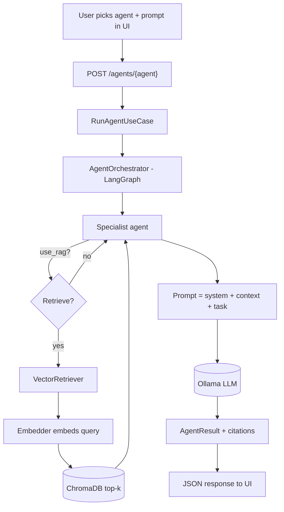
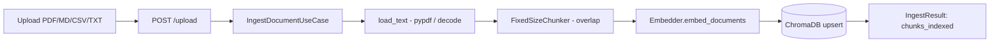
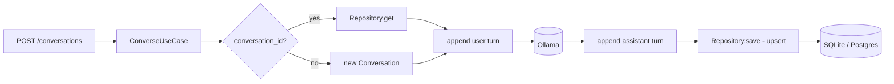

# Data Flow

How data moves through the system for the two primary journeys. For the static
structure see [ARCHITECTURE.md](ARCHITECTURE.md).

## 1. Agent request (with optional RAG grounding)

Grounding is optional per request (`use_rag`); the RAG agent always retrieves.
Citations flow back with the answer.

## 2. Document ingestion

## 3. Persistence of a conversation

Every boundary crossing maps transport ↔ DTO ↔ domain, so no framework or ORM
type ever reaches the domain core.
